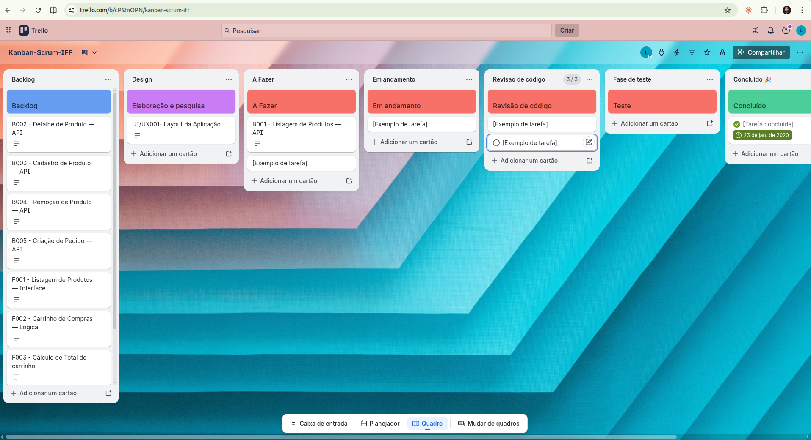
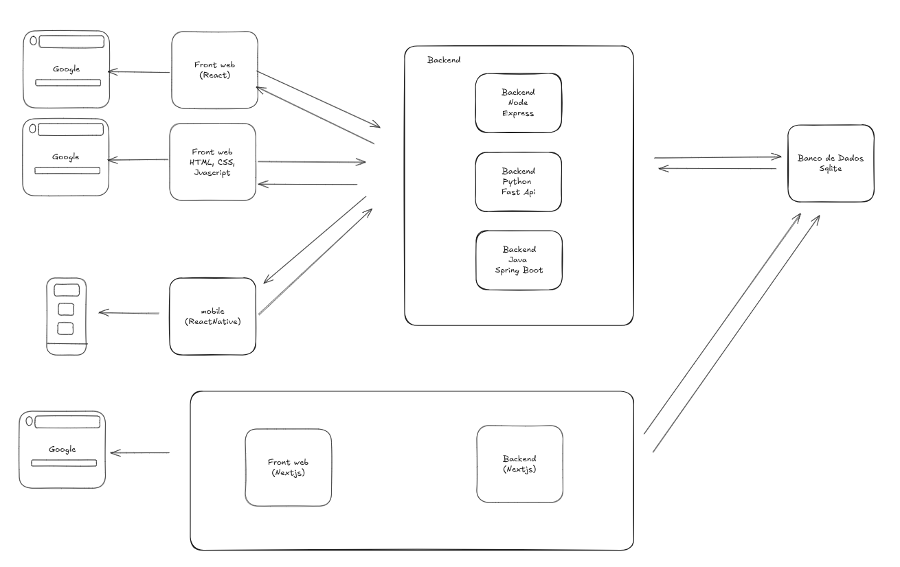
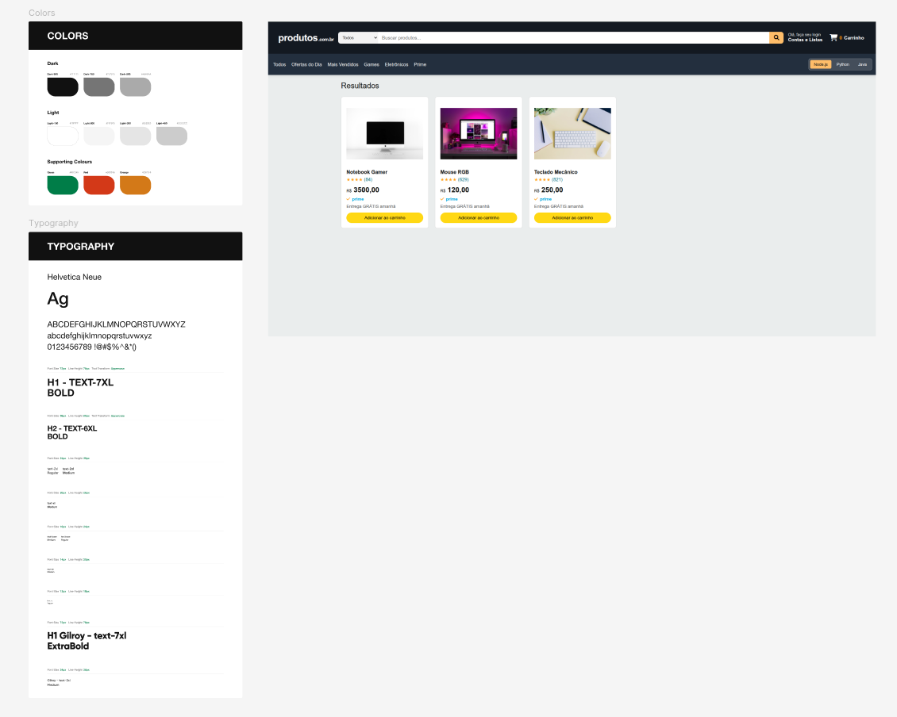
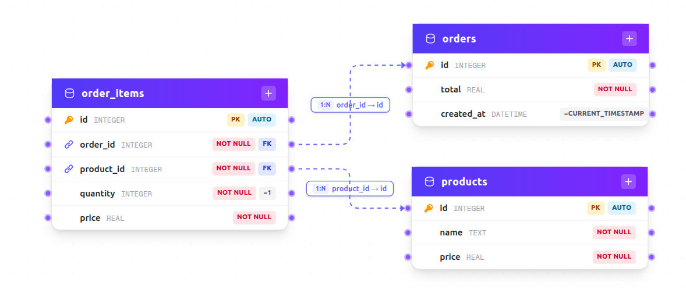
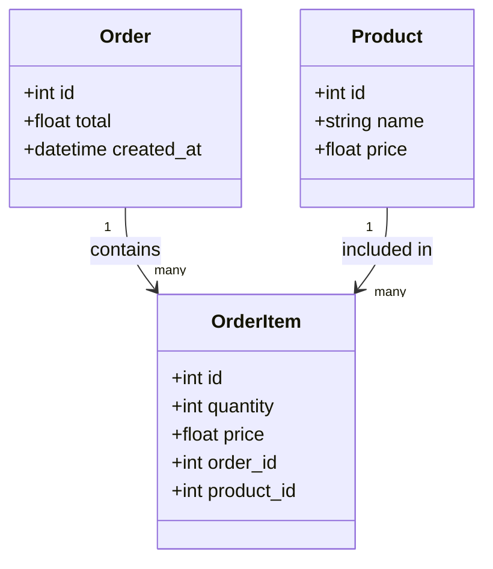
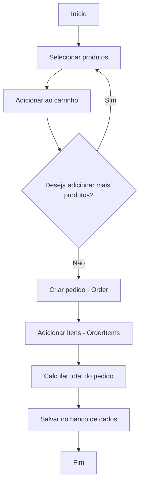
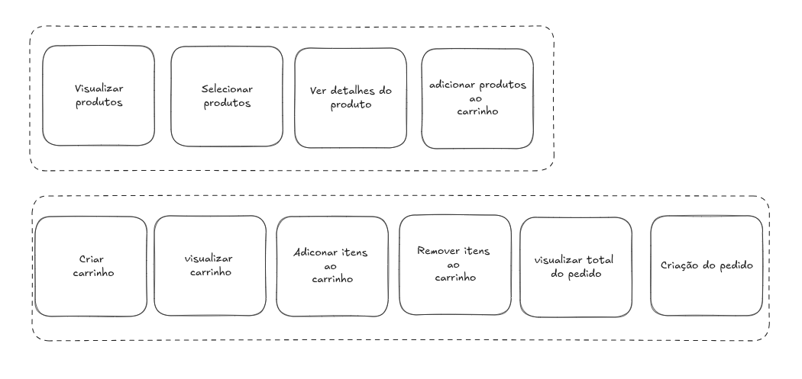

# Projeto E-commerce — Full Stack (Java | Node.js | Python | Web | Mobile)

Desenvolvimento de Sofwatres:
- Planejamento
- Engenahria de requisitos
- Projetos
- Implementação
- Testes
- Implantação
- Manutenção

Desenvolvimento Web Moderno

## Planejamento 
- Escopo
- Tempo
- Cronograma

## Engenharia de requisitos

### Gerenciamento do Backlog



https://trello.com/b/cPSfnOPN/kanban-scrum-iff 

## Projetos

### Projeto Arquitetural




Projeto backend - MVC
```
src/
├── controllers/   # recebe requisição (HTTP)
├── models/        # dados / banco
├── views/         # resposta (JSON ou templates)
├── services/      # regras de negócio
├── routes/        # define endpoints
├── middlewares/   # interceptadores (auth, log)
├── config/        # configs (db, env)
└── app.js         # inicialização da aplicação
```

Projeto Frontend

```
src/
├── components/      # componentes reutilizáveis (botão, card, input)
├── pages/           # telas da aplicação
├── services/        # comunicação com backend (API)
├── hooks/           # hooks customizados
├── context/         # estado global (ex: carrinho)
├── routes/          # rotas da aplicação
├── utils/           # funções auxiliares
├── styles/          # estilos globais
├── App.jsx
└── main.jsx
```

### Projeto de interface

- Prototipação UI/UX



### Projeto de banco de dados



### Diagrama de classe



### Diagrama de atividades



## Jornada do usuário (event storming)



## Estrutura de Pastas

```
src/
│
├── modules/
│   └── order/
│       ├── controllers/
│       │   └── OrderController.js
│       │
│       ├── services/
│       │   └── CreateOrderService.js
│       │   └── AddItemToOrderService.js
│       │   └── CalculateOrderTotalService.js
│       │
│       ├── repositories/
│       │   └── OrderRepository.js
│       │
│       ├── models/
│       │   └── Order.js
│       │   └── OrderItem.js
│       │
│       └── routes/
│           └── order.routes.js
│
├── modules/
│   └── product/
│       ├── controllers/
│       ├── services/
│       ├── repositories/
│       ├── models/
│       └── routes/
│
├── shared/
│   ├── database/
│   │   └── connection.js
│   │
│   ├── middlewares/
│   │   └── errorHandler.js
│   │
│   └── utils/
│
├── app.js
└── server.js
```

## Implementação

### 📅 Gestão da Equipe: Cerimônias do Scrum

1. **Refinamento (Backlog Refinement)**
   Refinamento do backlog

2. **Sprint Planning (Planejamento da Sprint)**
   Define o que será feito na sprint e como o trabalho será realizado.

3. **Daily Scrum (Daily / Reunião diária)**
   Reunião curta (até 15 min) para alinhar o progresso e identificar impedimentos.

4. **Sprint Review (Revisão da Sprint)**
   Demonstração do que foi entregue para stakeholders e coleta de feedback.

5. **Sprint Retrospective (Retrospectiva)**
   Momento para o time refletir sobre o processo e melhorar continuamente.

## Estrutura atual

```
projeto01/
├── backend-java/         # API REST com Spring Boot
├── backend-node/         # API REST com Express + SQLite
├── backend-python/       # API REST com FastAPI + SQLAlchemy
├── frontend-html/        # Frontend HTML/CSS/JS puro
├── frontend-react/       # Frontend React + Vite
├── framework-nextjs/     # App Next.js com rotas API internas
├── mobile-react-native/  # App mobile com Expo/React Native
└── doc/geral/            # PRD, sprint, tarefas e tech spec
```

---

## Visão geral do projeto


## Backends

### 1) Node.js (Express)

Pré-requisitos:
- Node.js 18+
- npm

Execução:

```bash
cd backend-node
npm install
node server.js
```

URL base: http://localhost:3000

Endpoints:
- `GET /health`
- `GET /products`
- `GET /products/:id`
- `POST /products`
- `DELETE /products/:id`
- `POST /orders`

---

### 2) Python (FastAPI)

Pré-requisitos:
- Python 3.11+
- Poetry

Execução:

```bash
cd backend-python
poetry install
poetry run uvicorn app.main:app --reload --port 4000
```

URL base: http://127.0.0.1:4000  
Swagger: http://127.0.0.1:4000/docs

Endpoints principais:
- `GET /products`
- `POST /orders`

---

### 3) Java (Spring Boot)

Pré-requisitos:
- Java 17+

Execução:

```bash
cd backend-java
./mvnw spring-boot:run
```

No Windows:

```bash
mvnw.cmd spring-boot:run
```

URL base: http://localhost:8080

Endpoints principais:
- `GET /api/products`
- `GET /api/products/{id}`
- `POST /api/products`
- `DELETE /api/products/{id}`

---

## Frontends

### 1) HTML estático

```bash
cd frontend-html
```

Abrir no navegador:
- `index.html` (principal)
- `indexV1.html`
- `indexV2.html`

> Dica: usar Live Server no VS Code.

---

### 2) React + Vite

```bash
cd frontend-react
npm install
npm run dev
```

URL: http://localhost:5173

Observação:
- Possui seletor de backend (Node, Python, Java).
- Usa fallback com dados mock quando a API não responde.

---

### 3) Next.js

```bash
cd framework-nextjs
npm install
npm run dev
```

URL: http://localhost:3000

Rotas API internas:
- `GET /api/products`
- `POST /api/products`
- `POST /api/orders`

---

### 4) Mobile (Expo / React Native)

```bash
cd mobile-react-native
npm install
npm run start
```

Também disponível:
- `npm run android`
- `npm run ios`
- `npm run web`

---

## Documentação do projeto

Arquivos de apoio em `doc/geral/`:
- `prd.md`
- `Sprint.md`
- `tasks.md`
- `techspec.md`

---

## Observações importantes

- Cada backend é independente.
- O frontend React foi preparado para integração com os 3 backends.
- Node, Python e Java usam SQLite no projeto (com configuração específica por stack).
- Para evitar conflito de porta, rode os módulos conforme necessidade (ex.: Node e Next usam `3000`).

### implementação da telemetria

instrumenta o código para gerar dados:

* Logs (console.log, logger)
* Métricas (tempo de resposta, contadores)
* Traces (requisições entre serviços)


## Testes

- Plano de Teste
- [Plano de Teste](doc/teste/plano%20de%20teste.md)
- Teste de performance com K6
- Teste de usabilidade:
Com cerca de 5 usuários, você consegue identificar ~85% dos problemas de usabilidade.
Isso vem dos estudos de Jakob Nielsen, um dos maiores nomes de UX.
- observabilidade para validar comportamento: Você usa os dados coletados para entender: O sistema está lento? Tem erro escondido? Algo estranho acontecendo?

## Implantação

- Deploy
- Telemetria e observabilidade
